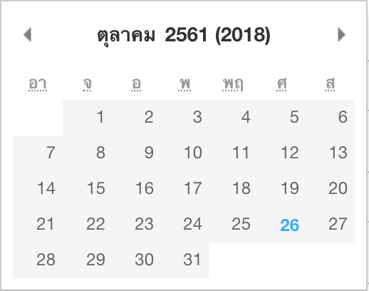

Palitday
========

### Palitday: Pikaday สำหรับคนรัก Palitchoke
package นี้  fork มาจาก [pikaday](https://github.com/Pikaday/Pikaday) เครดิตทั้งหมดยกให้ผู้เขียนต้นเฉบับและ PECK 😚😘

### Why Palitday ?
อยากใช้ปี พ.ศ. กับ pikaday แต่ตัวต้นฉบับไม่มีเลยปรับโค้ดใช้เอง ที่ต้อง fork มาก็เพราะอาย ไม่กล้า PR

## Installation

    npm i palitday

## Usage

**Palitday** ไม่มีคน maintain นะจ๊ะ ดังนั้นจะ update ถึง Pikaday 1.8.0 เท่านั้น
การใช้งานให้ใช้ตามคู่มือของ [Pikaday](https://github.com/Pikaday/Pikaday) ได้เลย

## Buddhist calendar

ใช้งานด้วยการ config `nuchYearFormat` รับค่าเป็น Array เท่านั้นมีได้ 4 แบบ
1. `["AD"] // แสดงค่า ค.ศ. อย่างเดียว`
2. `["ฺBE"] // แสดงค่า พ.ศ. อย่างเดียว`
3. `["AD", "BE"] // แสดงค่า ค.ศ. (พ.ศ.)`
4. `["BE", "AD"] // แสดงค่า พ.ศ. (ค.ศ.)`

ตัวอย่าง code ก็ประมาณเนี๊ยะ
```javascript
var picker = new Palitday({
                    field: document.getElementById("datepicker"),
                    nuchYearFormat: ["BE", "AD"]
                 });
```



Pikaday with Buddhist calendar support
